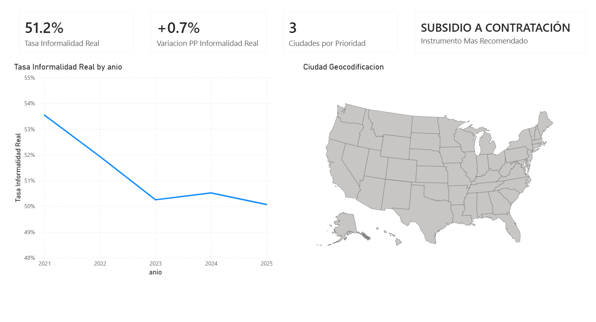
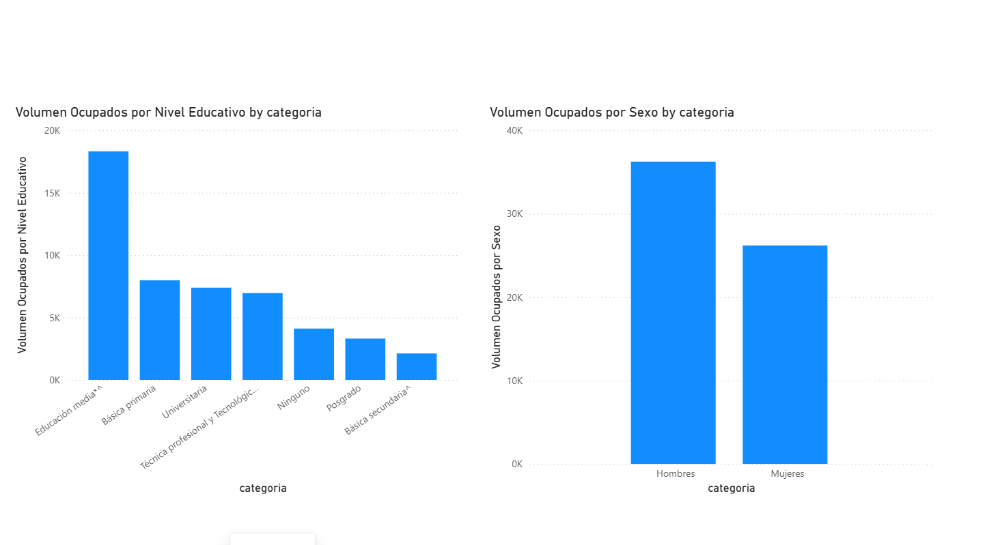
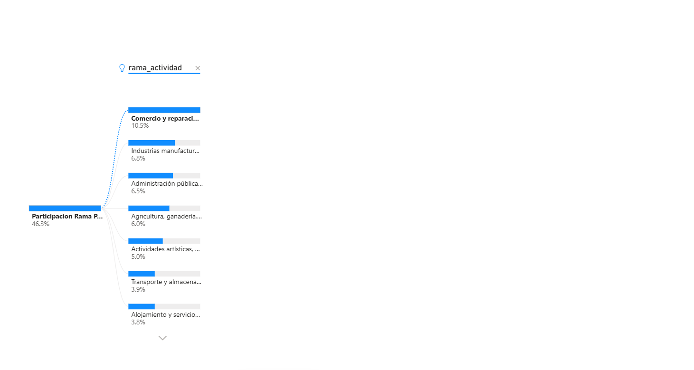

# 📊 Medallion GEIH - Ingesta y Transformación de Datos en Databricks

> **Proyecto de análisis del mercado laboral colombiano** usando la **Gran Encuesta Integrada de Hogares (GEIH)** del DANE, procesada con arquitectura Medallion en Databricks y visualizada en Power BI.

---

## 🗂️ Tabla de Contenidos

1. [¿Qué es este proyecto?](#-qué-es-este-proyecto)
2. [Arquitectura Medallion](#-arquitectura-medallion)
3. [Fuente de datos: GEIH](#-fuente-de-datos-geih)
4. [Pipeline de Ingesta y Transformación](#-pipeline-de-ingesta-y-transformación)
5. [Conexión Databricks → Power BI](#-conexión-databricks--power-bi)
6. [Visualizaciones en Power BI](#-visualizaciones-en-power-bi)
7. [Estructura del Repositorio](#-estructura-del-repositorio)
8. [Tecnologías Utilizadas](#-tecnologías-utilizadas)

---

## 🎯 ¿Qué es este proyecto?

Este proyecto implementa un **pipeline completo de datos** para analizar el mercado laboral en Colombia a partir de los microdatos de la **Gran Encuesta Integrada de Hogares (GEIH)**, publicada trimestralmente por el DANE.

El objetivo es responder preguntas clave como:
- ¿Cuál es la **tasa de informalidad laboral** y cómo ha evolucionado entre 2021 y 2025?
- ¿Qué **sectores económicos** concentran mayor informalidad?
- ¿Cómo se distribuye la informalidad por **nivel educativo** y **género**?
- ¿Qué **instrumento de política pública** es más recomendado para reducirla?

---

## 🏛️ Arquitectura Medallion

El proyecto sigue la **arquitectura Medallion de tres capas** (Bronze → Silver → Gold), estándar en proyectos de Data Engineering modernos:

```
Archivos Excel GEIH (fuente)
          │
          ▼
    ┌─────────────┐
    │   BRONZE    │  ← Ingesta cruda de archivos Excel (.xlsx)
    │             │     sin transformaciones, datos tal como vienen
    └──────┬──────┘
           │
           ▼
    ┌─────────────┐
    │   SILVER    │  ← Limpieza, estandarización, tipado de columnas,
    │             │     unión de períodos (2021-2025)
    └──────┬──────┘
           │
           ▼
    ┌─────────────┐
    │    GOLD     │  ← Métricas agregadas: tasa informalidad,
    │             │     segmentación por ciudad, sector, género
    └──────┬──────┘
           │
           ▼
       Power BI
```

**¿Por qué Medallion?** Esta arquitectura garantiza trazabilidad total del dato, separa responsabilidades por capa, y permite reprocesar sin perder los datos originales.

---

## 📋 Fuente de Datos: GEIH

La **Gran Encuesta Integrada de Hogares (GEIH)** es la encuesta de hogares más importante de Colombia:

- **Entidad:** DANE (Departamento Administrativo Nacional de Estadística)
- **Frecuencia:** Trimestral / Mensual
- **Cobertura:** Nacional y 13 principales ciudades
- **Período analizado:** 2021 – 2025
- **Archivo procesado:** `anex-GEIH-abr2026.xlsx` (datos de informalidad por ciudad)

Las variables clave procesadas incluyen:
| Variable | Descripción |
|---|---|
| `tasa_informalidad_real` | Porcentaje de ocupados en empleo informal |
| `ciudad` | Ciudad de residencia del encuestado |
| `rama_actividad` | Sector económico (comercio, industria, agro, etc.) |
| `nivel_educativo` | Máximo nivel de educación alcanzado |
| `sexo` | Género del ocupado (Hombre / Mujer) |
| `anio` | Año de la encuesta |
| `instrumento_politica` | Política pública recomendada para reducir informalidad |

---

## ⚙️ Pipeline de Ingesta y Transformación

El notebook `Medallion GEIH - Ingesta y Transformación.py` implementa el pipeline completo en **Apache Spark** sobre Databricks. A continuación se describe cada etapa:

### 1️⃣ Instalación de dependencias
```python
%pip install openpyxl --quiet
```
Instala la librería necesaria para leer archivos Excel con Spark/Pandas.

### 2️⃣ Reinicio del kernel
```python
dbutils.library.restartPython()
```
Reinicia el kernel de Python para que las nuevas librerías queden activas.

### 3️⃣ Exploración de archivos Excel (Capa Bronze)
```python
excel_file1 = pd.ExcelFile(archivo_geih)
hojas1 = excel_file1.sheet_names
print(f"Total de hojas: {len(hojas1)}")
```
Se exploran todas las hojas del archivo GEIH para entender su estructura antes de ingestar.

### 4️⃣ Función helper de ingesta (Bronze → Silver)
Se define una función genérica que:
- Lee cada hoja del Excel con Pandas, saltando las primeras **12 filas de metadatos** del DANE
- Convierte el DataFrame a Spark
- Almacena en la capa Bronze de Delta Lake

```python
def leer_hoja_excel_geih(archivo_path, nombre_hoja, skiprows=12):
    """Lee una hoja de Excel saltando las primeras 12 filas de metadatos"""
    df = pd.read_excel(archivo_path, sheet_name=nombre_hoja, skiprows=skiprows)
    return spark.createDataFrame(df)
```

> **¿Por qué `skiprows=12`?** Los archivos GEIH del DANE incluyen encabezados institucionales, notas metodológicas y firmas en las primeras filas antes de llegar a los datos reales.

### 5️⃣ Transformaciones Silver
- Estandarización de nombres de columnas (minúsculas, sin tildes, sin espacios)
- Limpieza de valores nulos en variables clave
- Casting de tipos: numéricos, fechas, categorías
- Unión de múltiples trimestres en una sola tabla

### 6️⃣ Agregaciones Gold
- Cálculo de tasa de informalidad por año y ciudad
- Segmentación por rama de actividad económica
- Cruce de informalidad × nivel educativo × sexo
- Ranking de instrumentos de política pública recomendados por ciudad

---

## 🔌 Conexión Databricks → Power BI

Una vez que los datos están procesados en la capa **Gold** de Databricks, se conectan directamente a **Power BI** usando el conector nativo de Databricks. Así funciona la conexión:

### Pasos de la conexión

**1. Obtener el Server Hostname y HTTP Path en Databricks**

En Databricks, navegar a:
`Compute → [nombre del cluster] → Advanced Options → JDBC/ODBC`

Copiar:
- **Server Hostname:** `dbc-19bafec8-ca68.cloud.databricks.com`
- **HTTP Path:** `/sql/1.0/warehouses/...` (o path del cluster)

**2. Abrir Power BI Desktop**

Ir a: `Obtener datos → Azure → Azure Databricks`

**3. Configurar la conexión**

| Campo | Valor |
|---|---|
| Server Hostname | `dbc-19bafec8-ca68.cloud.databricks.com` |
| HTTP Path | Path del SQL Warehouse o cluster |
| Catálogo | `hive_metastore` |
| Base de datos | `default` (o la que corresponda) |
| Modo de conectividad | DirectQuery o Importar |

**4. Autenticación**

Se usa un **Personal Access Token (PAT)** de Databricks como contraseña de acceso.

**5. Seleccionar tablas Gold**

Power BI lista todas las tablas disponibles en el metastore de Databricks. Se seleccionan las tablas de la capa Gold (informalidad agregada, segmentaciones).

**6. Cargar y modelar**

Los datos se cargan en Power BI, donde se construyen las relaciones entre tablas y se crean las medidas DAX para los indicadores del dashboard.

---

## 📈 Visualizaciones en Power BI

Los dashboards construidos en Power BI a partir de los datos procesados en Databricks muestran el panorama completo de la informalidad laboral en Colombia.

---

### 📊 Dashboard 1: Indicadores Principales de Informalidad



**¿Qué muestra este dashboard?**

Este es el panel principal del proyecto. Incluye cuatro indicadores clave y dos visualizaciones geográficas/temporales:

- **51.2% — Tasa de Informalidad Real:** Más de la mitad de los ocupados en Colombia se encuentran en situación de informalidad laboral. Este indicador es la métrica central del análisis.

- **+0.7 pp — Variación Puntos Porcentuales:** La informalidad aumentó 0.7 puntos porcentuales respecto al período anterior, lo que indica una tendencia levemente alcista tras años de descenso.

- **3 — Ciudades por Prioridad:** El modelo identifica 3 ciudades prioritarias donde la intervención de política pública tendría mayor impacto en reducción de informalidad.

- **Subsidio a Contratación — Instrumento Más Recomendado:** De todos los instrumentos de política pública analizados, el subsidio directo a la contratación formal emerge como el más efectivo según los datos.

- **Gráfica de línea — Tasa de Informalidad Real por Año (2021–2025):** Se observa una tendencia **descendente** desde el 53.7% en 2021 hasta el 50.1% en 2025, con una pequeña recuperación en 2023-2024. Esto refleja los efectos de la pandemia y la recuperación económica post-COVID.

- **Mapa — Ciudad Geocodificación:** Mapa interactivo que permite identificar geográficamente las ciudades analizadas.

---

### 📊 Dashboard 2: Informalidad por Nivel Educativo y Género



**¿Qué muestra este dashboard?**

Este panel analiza **quiénes son los informales** en términos de su perfil educativo y género:

**Volumen de Ocupados por Nivel Educativo:**
La gráfica de barras muestra que la informalidad es más prevalente en personas con **educación media** (~18K ocupados informales), seguida por quienes tienen **básica primaria** (~8K) y **universitaria** (~7.5K). 

> **Interpretación clave:** La alta concentración de informales con educación media (bachillerato) indica que completar el bachillerato no es suficiente para garantizar acceso al empleo formal. Se requieren políticas de formación para el trabajo y certificación de competencias.

**Volumen de Ocupados por Sexo:**
- **Hombres:** ~35K ocupados en informalidad
- **Mujeres:** ~25K ocupadas en informalidad

> Los hombres representan mayor volumen absoluto de informalidad, pero este dato debe contextualizarse con la tasa de participación laboral diferenciada por género. Las mujeres enfrentan barreras adicionales para la formalización (trabajo de cuidado no remunerado, jornadas parciales, etc.).

---

### 📊 Dashboard 3: Participación por Rama de Actividad Económica



**¿Qué muestra este dashboard?**

Este panel responde **¿en qué sectores se concentra la informalidad?**

El gráfico de árbol jerárquico muestra la distribución por rama de actividad económica, con una participación total del **46.3%** en las ramas representadas:

| Rama de Actividad | Participación |
|---|---|
| Comercio y reparación de vehículos | 10.5% |
| Industrias manufactureras | 6.8% |
| Administración pública | 6.5% |
| Agricultura, ganadería, caza y silvicultura | 6.0% |
| Actividades artísticas, entretenimiento y recreación | 5.0% |
| Transporte y almacenamiento | 3.9% |
| Alojamiento y servicios de comida | 3.8% |

> **Interpretación clave:** El **comercio** es el sector con mayor informalidad, seguido por manufactura y administración. Esto es consistente con la estructura económica colombiana donde el comercio informal (vendedores ambulantes, tiendas de barrio, mercados) representa una fracción enorme del empleo. Las políticas de formalización deben priorizar este sector.

---

## 📁 Estructura del Repositorio

```
Medallion_GEIH_Databricks/
│
├── Medallion+GEIH+-+Ingesta+y+Transformacion.py   # Notebook principal: pipeline completo
│                                                   # Bronze → Silver → Gold en Databricks
│
├── powerbi_dashboard_informalidad.png              # Dashboard 1: Indicadores principales
│                                                   # Tasa informalidad, evolución 2021-2025
│
├── powerbi_educacion_sexo.png                      # Dashboard 2: Perfil del trabajador informal
│                                                   # Por nivel educativo y género
│
├── powerbi_rama_actividad.png                      # Dashboard 3: Sectores económicos
│                                                   # Distribución por rama de actividad
│
└── README.md                                       # Este archivo
```

---

## 🛠️ Tecnologías Utilizadas

| Tecnología | Rol en el proyecto |
|---|---|
| **Azure Databricks** | Plataforma de procesamiento distribuido (Apache Spark) |
| **Delta Lake** | Almacenamiento de datos con arquitectura Medallion |
| **Apache Spark** | Motor de procesamiento para transformaciones a escala |
| **PySpark** | API de Python para Spark — lógica de transformación |
| **Pandas** | Lectura inicial de archivos Excel del DANE |
| **openpyxl** | Parser de archivos .xlsx |
| **Power BI Desktop** | Visualización e inteligencia de negocio |
| **Power BI Connector for Databricks** | Conexión directa entre Databricks y Power BI |
| **GitHub** | Control de versiones y documentación del proyecto |
| **GEIH - DANE** | Fuente de datos oficial del mercado laboral colombiano |

---

## 👤 Autor

**Brandon Arboleda** | [@barboleda2-coder](https://github.com/barboleda2-coder)

*Proyecto desarrollado como ejercicio académico de análisis de datos con Big Data.*
